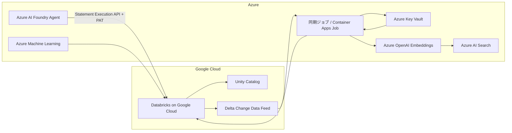
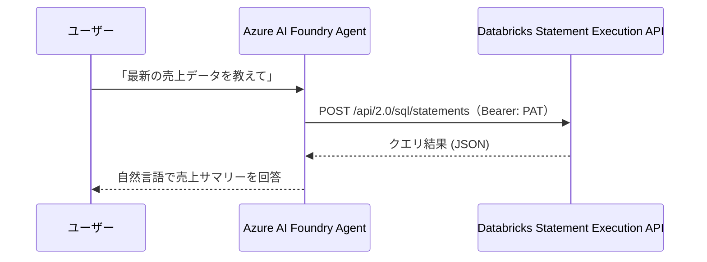
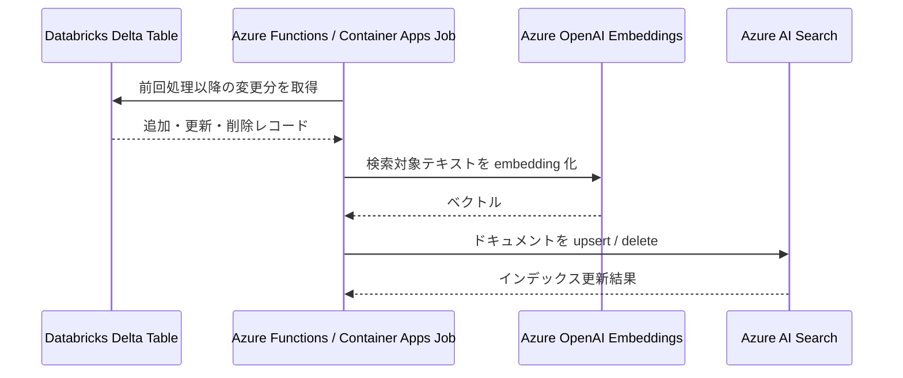
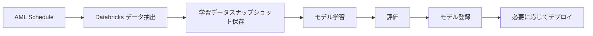
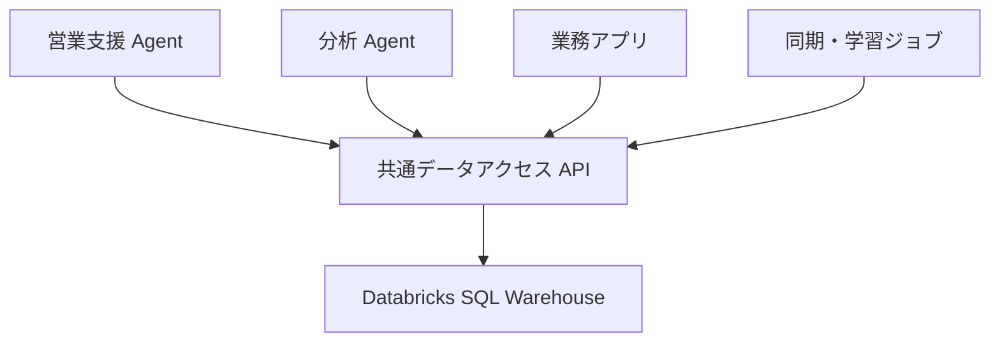

# Azure から Google Cloud 上の Databricks データを活用する検証手順

## 目的

Azure 側の Agent、アプリケーション、Azure AI Search、Azure Machine Learning から、Google Cloud 上の Databricks にある同一データを安全かつ再利用可能な形で活用できることを確認する。

検証する動作は次の 4 点。

1. 最新データを必要なタイミングで Databricks から直接参照する
2. Databricks のデータ更新に合わせて Azure AI Search などのベクトル DB を自動更新する
3. Databricks のデータを利用して定期的に AI モデルを再学習する
4. 同じ Databricks データを複数の Agent やアプリケーションから利用できるようにする

## 想定アーキテクチャ



## 前提条件

### Google Cloud / Databricks

- Databricks on Google Cloud の Workspace が作成済みであること
- Databricks SQL Warehouse が起動できること
- 検証用テーブル `sales_transactions` が Unity Catalog 配下に作成済みであること
- 検証用テーブルで必要に応じて Delta Change Data Feed を有効化できること
- Azure 側から Databricks SQL Warehouse の HTTPS エンドポイントへ到達できること

***Unity Catalog 配下にしている理由***

Unity Catalog 配下にしている理由は、「Azure 側から複数用途で同じ Databricks データを安全に使う」検証のため。

1. 権限管理をテーブル単位で明確にできる
Unity Catalog なら、Catalog / Schema / Table / View 単位で権限を管理できます。
Azure 側 API、同期ジョブ、学習ジョブなどに対して「どのデータを読ませるか」を統制しやすくなります。

2. 複数 Agent / アプリで同じデータ定義を共有しやすい
catalog.schema.sales_transactions のように完全修飾名で参照できるため、Agent A、Agent B、Azure AI Search 同期ジョブ、AML 再学習ジョブが同じテーブルを安定して参照できます。

3. 監査・リネージ・ガバナンスを確認できる
今回の検証は単に SQL が読めるかだけでなく、複数システムから使う前提です。Unity Catalog を使うと、誰がどのデータにアクセスしたか、どのデータがどの用途に使われたかを追いやすくなります。


### Azure

- Azure サブスクリプションを利用できること
- Azure AI Foundry プロジェクトを作成済みであること
  - 今回の検証に使用: `ti-demo-ai-agents-swc-foundry / proj-default`（swedencentral）
- Databricks の Personal Access Token（PAT）を発行できること
- Azure Key Vault を作成済み、または作成できること（検証 2〜4 で使用）
- Azure AI Search を作成済み、または作成できること（検証 2 で使用）
- Azure OpenAI の embedding モデルを利用できること（検証 2 で使用）
- Azure Machine Learning Workspace を作成済み、または作成できること（検証 3 で使用）

## 共通設定

### 1. Databricks 接続情報を確認する

Databricks SQL Warehouse から以下を確認する。

- Server hostname
- HTTP path
- Catalog 名
- Schema 名
- 検証テーブル名: `sales_transactions`
- Personal Access Token またはサービスプリンシパル相当の認証情報

### 2. Databricks PAT を発行する

Databricks の PAT（Personal Access Token）は検証 1 の Tool 認証に使用する。

**PAT の発行手順**

1. Databricks ワークスペース（`8259552429116742.2.gcp.databricks.com`）にログインする
2. 右上のユーザーアイコン → **Settings**
3. **Developer** → **Access tokens** → **Generate new token**
4. 名前（例: `foundry-agent-tool`）と有効期限を設定して生成する
5. 表示されたトークン値（`dapi...`）を安全な場所にコピーする（再表示不可）

> PAT は Foundry の Custom keys Project Connection に保存する。Terminal、チャット、設定ファイル、OpenAPI 定義には貼り付けない。

**Key Vault への保存（検証 2〜4 用）**

```powershell
az keyvault secret set --vault-name <key-vault-name> --name databricks-host --value <server-hostname>
az keyvault secret set --vault-name <key-vault-name> --name databricks-http-path --value <http-path>
az keyvault secret set --vault-name <key-vault-name> --name databricks-token --value <token>
```

### 3. 検証用テーブルを確認する

今回の検証では Databricks の組み込みサンプルデータ `samples.bakehouse.sales_transactions` を使用する。テーブル作成は不要。

| 項目 | 値 |
| --- | --- |
| Server hostname | `8259552429116742.2.gcp.databricks.com` |
| Port | `443` |
| HTTP path | `/sql/1.0/warehouses/729062798c1046d0` |
| Catalog | `samples` |
| Schema | `bakehouse` |
| テーブル | `sales_transactions` |
| 完全修飾名 | `samples.bakehouse.sales_transactions` |
| SQL Warehouse | Serverless Starter Warehouse |

テーブル構造を確認する場合は以下を実行する。

```sql
DESCRIBE TABLE samples.bakehouse.sales_transactions;
```

可能であれば、Agent 専用の View を作成し、PAT を発行するユーザーまたはサービスプリンシパルには対象 Warehouse の `CAN USE` と、その View への `SELECT` だけを付与する。Statement Execution API の実行可否は、認証主体の Warehouse 権限と Unity Catalog のオブジェクト権限で制御する。

```sql
CREATE VIEW <agent_catalog>.<agent_schema>.sales_transactions_agent_view AS
SELECT
    transaction_date,
    product_category,
    region,
    quantity,
    sales_amount
FROM samples.bakehouse.sales_transactions;
```

## 検証 1: 最新データを必要なタイミングで直接参照する

### 構成

Azure AI Foundry Agent が Databricks Statement Execution REST API を OpenAPI Tool として直接呼び出す。Logic App は使用しない。Azure Functions や Key Vault は不要で、PoC では PAT を Foundry の Custom keys Project Connection に `Authorization: Bearer <Databricks PAT>` として保存する。



### 必要なリソース

| リソース | 内容 |
| --- | --- |
| Foundry Agent | 任意の Agent 名（既存の Agent でも可） |
| Foundry プロジェクト | Azure AI Foundry の Project エンドポイント |
| OpenAPI スキーマ | `samples/databricks-tool-openapi.json` |
| Foundry Project Connection | Custom keys Connection（key: `Authorization`） |
| Databricks SQL Warehouse | Statement Execution API が有効な Warehouse |

### 実装方針

- OpenAPI Tool は `POST /api/2.0/sql/statements` の 1 操作だけを登録する
- `operationId` は `execute_sales_query` とする
- OpenAPI スキーマの request body は `warehouse_id` と `statement` の 2 項目だけにする
- `warehouse_id` は OpenAPI スキーマの enum で接続先 Warehouse ID に固定する
- SQL では対象テーブルの完全修飾名（`catalog.schema.table`）を必ず使用する
- Agent instructions だけをセキュリティ境界にせず、Databricks 側の Unity Catalog 権限で対象データを最小化する
- Instructions は認可制御ではなく挙動ガイドである。実効的な制御は Databricks 認証と Unity Catalog 権限で行う

### 手順

#### 1. 環境変数を設定する

`.env.local` を編集して Databricks と Azure Foundry の接続情報を設定する。詳細は `.env.local.example` を参照。

```powershell
# .env.local から環境変数を読み込む
Get-Content .env.local | ForEach-Object {
    if ($_ -match '^([^#=]+)=(.+)$') {
        [System.Environment]::SetEnvironmentVariable($Matches[1].Trim(), $Matches[2].Trim(), 'Process')
    }
}
```

#### 2. OpenAPI スキーマのプレースホルダを置換する

`samples/databricks-tool-openapi.json` を開き、`<your-databricks-host>` と `<your-warehouse-id>` を実際の値に置き換える。

```json
"servers": [{ "url": "https://<your-databricks-host>.gcp.databricks.com" }]
```

```json
"enum": ["<your-warehouse-id>"]
```

#### 3. Databricks PAT を発行する

共通設定 セクション 2 を参照して PAT を発行する。

#### 4. Foundry ポータルで Custom keys Project Connection を作成する

Foundry ポータルの **Project settings** → **Connections** で Custom keys Connection を作成する。

| 項目 | 値 |
| --- | --- |
| Connection name | `DatabricksSalesApi`（任意の名前。スクリプトの `--connection-name` と一致させる） |
| Connection type | Custom keys |
| Key | `Authorization` |
| Value | `Bearer <Databricks PAT>` |

`Bearer` と PAT の間には半角スペースを入れる。PAT は OpenAPI 定義のパラメーターやリポジトリに保存しない。

#### 5. スクリプトで Agent を作成する

`deploy_foundry_openapi_agent.py` を実行して OpenAPI Tool 付きの Agent バージョンを作成する。

```powershell
python samples/deploy_foundry_openapi_agent.py
```

引数で接続情報を変更する場合:

```powershell
python samples/deploy_foundry_openapi_agent.py `
    --project-endpoint $env:AZURE_FOUNDRY_PROJECT_ENDPOINT `
    --agent-name <agent-name> `
    --connection-name <connection-name> `
    --openapi samples/databricks-tool-openapi.json
```

スクリプトは次を実行する。

1. `AZURE_FOUNDRY_PROJECT_ENDPOINT` の Foundry Project に接続する
2. `DatabricksSalesApi` Project Connection を取得する
3. OpenAPI スキーマを読み込む（プレースホルダが残っていると `ValueError` で停止する）
4. `PromptAgentDefinition` に OpenAPI Tool と instructions を設定する
5. `create_version` で新しい Agent バージョンを作成する

成功すると次の JSON が出力される。

```json
{
  "name": "<agent-name>",
  "version": 1,
  "id": "...",
  "connection_name": "DatabricksSalesApi",
  "connection_id": "..."
}
```

#### 6. 動作を確認する

Foundry ポータルのチャット欄で次のように入力する。

```
売上トランザクションの件数を教えて
```

Agent が `execute_sales_query` Tool を呼び出し、対象テーブルの結果を自然言語で回答したら成功。続けて次の質問でサンプル取得と集計を確認する。

```
サンプル行を5件見せて
```

```
カテゴリ別の売上件数をまとめて
```

対象外テーブルへのアクセスを拒否することも確認する。

```
system.information_schema.tables を見せて
```

### 確認用 SQL（Databricks 側で直接実行する場合）

```sql
SELECT *
FROM <catalog>.<schema>.sales_transactions
LIMIT 5;
```

OpenAPI Tool が送信する最小リクエスト例:

```json
{
    "warehouse_id": "<your-warehouse-id>",
    "statement": "SELECT COUNT(*) AS row_count FROM <catalog>.<schema>.sales_transactions"
}
```

テーブル構造を確認する場合:

```sql
DESCRIBE TABLE <catalog>.<schema>.sales_transactions;
```


## 検証 2: Databricks 更新に合わせて Azure AI Search を自動更新する

### 構成

Databricks の Delta Change Data Feed または更新時刻を使って変更分を抽出し、Azure 側のジョブで embedding を作成して Azure AI Search に upsert する。

今回のサンプルテーブル `samples.bakehouse.sales_transactions` には検証用の `updated_at` がないため、最初の PoC では冪等な full upsert を定期実行する。Search 側の index key は `transactionID` から生成するため、同じデータを複数回同期しても重複ドキュメントは作成されない。実データで検証する場合は CDF または `updated_at` に置き換える。



### Delta Change Data Feed を使う場合

Databricks 側で Change Data Feed を有効化する。

```sql
ALTER TABLE <catalog>.<schema>.sales_transactions
SET TBLPROPERTIES (delta.enableChangeDataFeed = true);
```

変更分を取得する。

```sql
SELECT *
FROM table_changes('<catalog>.<schema>.sales_transactions', <last_processed_version>);
```

今回の検証用テーブルでは、CDF を有効化済みの `workspace.default.sales_transactions_sync_test` を使う。初回は full upsert で Azure AI Search に現在状態を作成し、その時点の Delta table version を checkpoint に保存する。2 回目以降は `table_changes` から checkpoint 後の変更分だけを取得し、`insert` と `update_postimage` を upsert、`delete` を Search から削除する。

CDF 差分同期スクリプト:

```powershell
python samples/sync_databricks_cdf_to_ai_search.py `
    --source-table workspace.default.sales_transactions_sync_test `
    --index-name databricks-sales-transactions-sync-test `
    --checkpoint-file .sync-checkpoints/databricks-sales-cdf.json `
    --limit 100
```

1 回目の出力で `mode: baseline_full_sync` と `checkpoint_version` を確認する。この実行で baseline の index と checkpoint が作成される。

Databricks 側で CDF 対象テーブルを更新する。

```sql
UPDATE workspace.default.sales_transactions_sync_test
SET product = 'AI_SEARCH_CDF_TEST', quantity = 123
WHERE transactionID = 1001700;
```

変更行を Databricks 側で直接確認する場合:

```sql
SELECT transactionID, product, quantity, _change_type, _commit_version, _commit_timestamp
FROM table_changes('workspace.default.sales_transactions_sync_test', <checkpoint_version + 1>)
WHERE transactionID = 1001700
ORDER BY _commit_version, _change_type;
```

`UPDATE` では通常 `update_preimage` と `update_postimage` が出る。Azure AI Search に反映するのは更新後の値を持つ `update_postimage` だけで、`update_preimage` は無視する。

更新後に同じ CDF 差分同期スクリプトを再実行する。2 回目の出力で `mode: cdf_sync`、`upserted_documents`、`checkpoint_version` を確認する。

### `updated_at` を使う場合

Change Data Feed を使わない場合は、Azure 側で最終処理時刻を保持し、`updated_at` による差分取得を行う。

```sql
SELECT *
FROM <catalog>.<schema>.sales_transactions
WHERE updated_at > TIMESTAMP '<last_processed_timestamp>'
ORDER BY updated_at ASC;
```

### Azure AI Search インデックス例

| フィールド | 型 | 用途 |
| --- | --- | --- |
| `id` | `Edm.String` | 行内容から生成した hash を格納するキー |
| `content` | `Edm.String` | 取引 ID、顧客 ID、店舗 ID、商品、数量、価格などを連結した検索対象テキスト |
| `row_json` | `Edm.String` | Search に格納した元行の JSON 表現 |
| `contentVector` | `Collection(Edm.Single)` | Azure OpenAI で生成した embedding |
| `transactionID` | `Edm.String` | フィルター・確認用 |
| `customerID` | `Edm.String` | フィルター用 |
| `franchiseID` | `Edm.String` | フィルター用 |
| `dateTime` | `Edm.String` | 同期確認用 |
| `quantity` | `Edm.Int32` | フィルター・ソート用 |

### 今回使用する Azure リソース

| 項目 | 値 |
| --- | --- |
| Azure AI Search | `ti-demo-ai-agents-swc-search` |
| Resource Group | `rg-ti-demo-ai-agents-swc` |
| Search index | `databricks-sales-transactions-v2` |
| Azure OpenAI endpoint | `https://ti-demo-ai-agents-swc-foundry.cognitiveservices.azure.com/` |
| Embedding deployment | `text-embedding-3-large` |
| Embedding dimensions | `3072` |

Azure 側の事前確認結果:

- Azure AI Search の admin key 取得: 確認済み
- `databricks-sales-transactions-v2` index 作成: 確認済み
- `text-embedding-3-large` で 3072 次元 embedding 生成: 確認済み
- Databricks から 50 行を取得し、Azure AI Search に 50 ドキュメントを upsert: 確認済み
- `cardNumber` が `content` と `row_json` に含まれないこと: 確認済み

### 手順

#### 1. 同期スクリプトを実行する

`samples/sync_databricks_to_ai_search.py` は次を実行する。

1. Databricks Statement Execution API で `samples.bakehouse.sales_transactions` から行を取得する
2. 取得行から検索対象テキストを作る
3. Azure OpenAI `text-embedding-3-large` で embedding を生成する
4. Azure AI Search に vector search 対応 index を作成または更新する
5. Search index に `merge_or_upload` で upsert する

`cardNumber` は検索対象テキストと `row_json` から除外する。サンプルデータであっても、カード番号のような機微情報に見える値は Search index に格納しない。

PAT を環境変数に残さない場合は、次のコマンドを実行し、プロンプトに Databricks PAT を直接入力する。

```powershell
python samples/sync_databricks_to_ai_search.py --limit 50
```

環境変数で渡す場合:

```powershell
$env:DATABRICKS_PAT = "<Databricks PAT>"
python samples/sync_databricks_to_ai_search.py --limit 50
Remove-Item Env:DATABRICKS_PAT
```

Search 管理キーは既定では Azure CLI から取得する。明示する場合のみ `AZURE_SEARCH_API_KEY` を使う。

#### 2. 自動更新 PoC として定期ポーリング実行する

Databricks の更新に合わせた自動更新を簡易検証する場合は、同じ同期処理を一定間隔で繰り返す。

短時間の動作確認:

```powershell
python samples/sync_databricks_to_ai_search.py --limit 50 --repeat --iterations 2 --interval-seconds 30
```

検証中に Databricks 側のテーブルを更新できる場合は、1 回目の同期後、2 回目の同期前に Databricks 側で対象行を追加または更新し、2 回目の同期ログと Azure AI Search の検索結果に反映されることを確認する。

更新可能な検証用テーブルを使う場合は `--source-table` で同期元を切り替える。

```powershell
python samples/sync_databricks_to_ai_search.py `
    --source-table <catalog>.<schema>.sales_transactions_sync_test `
    --index-name databricks-sales-transactions-sync-test `
    --limit 50 `
    --repeat `
    --iterations 2 `
    --interval-seconds 30
```

出力例では `scheduled_polling: true`、`run: 1`、`run: 2`、`uploaded_documents`、`search_document_count`、`started_at`、`finished_at` を確認する。これにより、スケジューラーまたは常駐ジョブから同期処理を自動実行できることを検証する。

#### 3. Search index の件数を確認する

```powershell
$key = az search admin-key show `
    --resource-group rg-ti-demo-ai-agents-swc `
    --service-name ti-demo-ai-agents-swc-search `
    --query primaryKey -o tsv

$headers = @{ "api-key" = $key }
$uri = "https://ti-demo-ai-agents-swc-search.search.windows.net/indexes/databricks-sales-transactions-v2/docs/`$count?api-version=2024-07-01"
Invoke-RestMethod -Method GET -Uri $uri -Headers $headers
```

#### 4. キーワード検索を確認する

```powershell
$body = @{ search = "Bakery"; top = 5 } | ConvertTo-Json
$uri = "https://ti-demo-ai-agents-swc-search.search.windows.net/indexes/databricks-sales-transactions-v2/docs/search?api-version=2024-07-01"
$searchHeaders = @{
    "api-key" = $key
    "Content-Type" = "application/json"
}
Invoke-RestMethod -Method POST -Uri $uri -Headers $searchHeaders -Body $body | ConvertTo-Json -Depth 5
```

#### 5. Databricks 側の更新を使って反映を確認する

`samples.bakehouse.sales_transactions` は組み込みサンプルのため、環境によっては更新できない。その場合は Unity Catalog 配下に検証用テーブルを作成し、`--source-table` で同期元を切り替える。

検証用テーブルを作成できる場合の例:

```sql
CREATE OR REPLACE TABLE <catalog>.<schema>.sales_transactions_sync_test AS
SELECT *
FROM samples.bakehouse.sales_transactions
LIMIT 50;
```

自動ポーリング実行中に追加行を入れる例:

```sql
INSERT INTO <catalog>.<schema>.sales_transactions_sync_test
SELECT *
FROM samples.bakehouse.sales_transactions
LIMIT 1;
```

既存行の更新を確認する場合は、更新可能な Delta table に対して `UPDATE` を実行し、次回同期後に該当 `transactionID` の `content` または `row_json` が Azure AI Search 側で更新されることを確認する。

#### 6. 差分同期に拡張する

本番寄りの検証では、次のいずれかに変更する。

- Delta Change Data Feed を有効化し、`table_changes` で前回処理 version 以降を取得する
- `updated_at` 列を持つテーブルまたは View を作成し、前回処理時刻以降を取得する
- 削除同期が必要な場合は Search の `delete_documents` を組み合わせる

### 合格条件

- Databricks の追加・更新データが Azure AI Search に反映される
- 削除を扱う場合、Azure AI Search 側から該当ドキュメントが削除される
- 同期ジョブを複数回実行しても重複ドキュメントが作成されない
- 最終処理バージョンまたは最終処理時刻を保持し、差分同期できる

## 検証 3: Databricks データを利用して定期的に AI モデルを再学習する

### 構成

Azure Machine Learning のスケジュール実行パイプラインからデータアクセス API または Databricks SQL Warehouse を参照し、学習データのスナップショット作成、学習、評価、モデル登録までを自動化する。



今回の PoC では、まず `samples/train_sales_model_from_databricks.py` を使って Databricks の売上テーブルから学習データを取得し、`totalPrice` を予測する簡易回帰モデルを作成する。外部 ML ライブラリに依存せず、学習結果を `model.json`、評価指標を `metrics.json`、実行サマリーを `run_summary.json` として出力する。これにより、Azure ML の command job または schedule に載せる前に「Databricks の最新データを使って再学習 artifact が更新される」ことを確認できる。

### 今回使用する検証データ

| 項目 | 値 |
| --- | --- |
| 既定の同期元 | `workspace.default.sales_transactions_sync_test` |
| 入力特徴量 | `quantity`, `unitPrice` |
| 予測対象 | `totalPrice` |
| 出力先 | `outputs/sales-price-model` |
| 出力 artifact | `model.json`, `metrics.json`, `run_summary.json` |

### 手順

#### 1. ローカルで学習ジョブ相当の処理を実行する

PAT を環境変数に残さない場合は、次のコマンドを実行し、プロンプトに Databricks PAT を直接入力する。

```powershell
python samples/train_sales_model_from_databricks.py `
    --source-table workspace.default.sales_transactions_sync_test `
    --limit 500 `
    --output-dir outputs/sales-price-model
```

環境変数で渡す場合:

```powershell
$env:DATABRICKS_PAT = "<Databricks PAT>"
python samples/train_sales_model_from_databricks.py `
    --source-table workspace.default.sales_transactions_sync_test `
    --limit 500 `
    --output-dir outputs/sales-price-model
Remove-Item Env:DATABRICKS_PAT
```

出力例では `metrics.mae`、`metrics.rmse`、`metrics.r2` と `output_dir` を確認する。

#### 2. 学習 artifact を確認する

```powershell
Get-Content outputs/sales-price-model/run_summary.json
Get-Content outputs/sales-price-model/metrics.json
Get-Content outputs/sales-price-model/model.json
```

`run_summary.json` の `trained_at` が実行ごとに更新され、`train_rows` と `test_rows` が 0 より大きければ、Databricks から取得したデータで学習処理が完了している。

#### 3. Databricks 側のデータ更新後に再学習する

検証用テーブルを更新し、同じ学習コマンドを再実行する。

```sql
UPDATE workspace.default.sales_transactions_sync_test
SET totalPrice = 321, quantity = 7, unitPrice = 45
WHERE transactionID = 1001700;
```

再実行後、`run_summary.json` の `trained_at` と `metrics.json` が更新されることを確認する。これにより、Databricks 側の最新データを使ってモデルを再学習できることを検証する。

#### 4. Azure Machine Learning の command job として実行する

Azure ML Workspace を作成済みの場合は、同じスクリプトを command job の entry point として実行する。PAT は平文引数ではなく Key Vault または Azure ML の secure environment variable から渡す。

この検証環境では Azure ML CLI v2 拡張は導入済みだが、`rg-ti-demo-ai-agents-swc` には Azure ML Workspace がまだ存在しないことを確認済み。次フェーズでは、まず Workspace を作成または既存 Workspace を指定する。

Workspace がない場合の作成例:

```powershell
az ml workspace create `
    --resource-group rg-ti-demo-ai-agents-swc `
    --name mlw-ti-demo-databricks-swc `
    --location swedencentral
```

既定値を設定する。

```powershell
az configure --defaults `
    group=rg-ti-demo-ai-agents-swc `
    workspace=mlw-ti-demo-databricks-swc
```

このリポジトリには Azure ML command job 定義を用意している。

```text
azureml/sales-retrain-job.yml
```

Databricks PAT をリポジトリに保存しないため、実行時だけ PowerShell で非表示入力して job に渡す。複数行コマンドの貼り付けミスを避けるため、次の helper script を使用する。

```powershell
.\azureml\submit-sales-retrain-job.ps1
```

`Databricks PAT:` と表示されたら、PAT をターミナルに直接入力する。`-AsSecureString` を使うため、入力内容は画面に表示されない。

> 本番寄りにする場合は、PAT を直接 job environment variable に渡すのではなく、Key Vault、Managed Identity、または Databricks 側のサービスプリンシパル相当の認証方式へ置き換える。

```powershell
az ml job create `
    --resource-group <resource-group> `
    --workspace-name <aml-workspace-name> `
    --file <job-yaml-file>
```

job YAML では、`command` に次の処理を指定する。

```yaml
command: >-
  python samples/train_sales_model_from_databricks.py
  --source-table workspace.default.sales_transactions_sync_test
  --limit 500
  --output-dir outputs/sales-price-model
```

#### 5. Azure ML Schedule で定期実行する

command job が成功したら、日次または任意の頻度で schedule を作成する。

このリポジトリには日次実行の schedule 定義を用意している。

```text
azureml/sales-retrain-schedule.yml
```

作成例:

```powershell
$env:DATABRICKS_PAT = Read-Host "Databricks PAT"
az ml schedule create `
    --file azureml/sales-retrain-schedule.yml `
    --set create_job.environment_variables.DATABRICKS_PAT=$env:DATABRICKS_PAT
Remove-Item Env:DATABRICKS_PAT
```

```powershell
az ml schedule create `
    --resource-group <resource-group> `
    --workspace-name <aml-workspace-name> `
    --file <schedule-yaml-file>
```

スケジュール実行後、Azure ML のジョブ履歴で実行時刻、終了状態、出力 artifact、metrics を確認する。

#### 6. ユーザー自身で検証 3 の成功を確認する

ローカル実行済み artifact は次のコマンドで確認できる。

```powershell
python samples/verify_sales_model_artifacts.py `
    --artifact-dir outputs/sales-price-model `
    --min-train-rows 1 `
    --min-test-rows 1
```

`status: passed`、`model_type: ridge_regression`、`train_rows`、`test_rows`、`metrics` が表示されれば、Databricks データを使った学習 artifact の作成は成功している。

Azure ML job 実行後は、Azure ML Studio または `az ml job download` で job の出力を取得し、同じ検証スクリプトを出力ディレクトリに対して実行する。

### 実施結果

ローカルで Databricks から学習データを取得し、モデル artifact と metrics を作成できることを確認済み。

| 項目 | 結果 |
| --- | --- |
| 実行コマンド | `python samples/train_sales_model_from_databricks.py --source-table workspace.default.sales_transactions_sync_test --limit 500 --output-dir outputs/sales-price-model` |
| 実行結果 | 成功 |
| 学習データ | `train_rows: 40`, `test_rows: 10` |
| モデル | `ridge_regression` |
| 出力先 | `outputs/sales-price-model` |
| metrics | `mae: 24.901760678187163`, `rmse: 78.72784288583522`, `r2: -10.792376798814223` |

出力 artifact:

- `outputs/sales-price-model/model.json`
- `outputs/sales-price-model/metrics.json`
- `outputs/sales-price-model/run_summary.json`

この結果により、Databricks のデータを使って再学習処理を実行し、評価指標とモデル artifact を追跡できることを確認した。Azure ML の command job 化と schedule 化は次の段階で実施する。

Azure ML Command Job としての単発実行も確認済み。

| 項目 | 結果 |
| --- | --- |
| Azure ML Workspace | `mlw-ti-demo-databricks-swc` |
| Resource Group | `rg-ti-demo-ai-agents-swc` |
| system datastore auth mode | `identity` |
| Command Job | `epic_calypso_078fs96qj7` |
| Job status | `Completed` |
| ダウンロード先 | `azureml-downloads/epic_calypso_078fs96qj7/artifacts/outputs/sales-price-model` |
| artifact 検証 | `status: passed` |

Azure ML job 由来の artifact 検証コマンド:

```powershell
python samples/verify_sales_model_artifacts.py `
    --artifact-dir azureml-downloads/epic_calypso_078fs96qj7/artifacts/outputs/sales-price-model `
    --min-train-rows 1 `
    --min-test-rows 1
```

この単発 Command Job が成功したため、次の段階で Azure ML Schedule を作成できる。

### 合格条件

- スケジュールに従って再学習パイプラインが起動する
- 再学習ジョブが Databricks の最新データを抽出できる
- 学習に使ったデータスナップショット、コード、パラメーター、評価指標を追跡できる
- 評価結果に基づいてモデル登録またはデプロイ可否を判定できる

## 検証 4: 同じ Databricks データを複数の Agent やアプリケーションから利用する

### 構成

Databricks への接続を各 Agent やアプリケーションに分散させず、Azure 側に共通のデータアクセス API を置く。Agent、業務アプリケーション、バッチ処理、評価ジョブは同じ API を呼び出す。



### API 設計例

| エンドポイント | 用途 |
| --- | --- |
| `GET /sales/latest` | 最新売上データを取得する |
| `GET /sales/{transactionId}` | 特定取引の詳細を取得する |
| `POST /sales/query` | 許可された条件で集計・検索する |
| `GET /health/databricks` | Databricks 接続状態を確認する |

### 手順

1. 共通 API に認証を設定する
2. Agent A から `GET /sales/latest` を呼び出す
3. Agent B から同じ API を異なる条件で呼び出す
4. 業務アプリケーションから同じ API を呼び出す
5. Databricks 側のデータを更新する
6. すべての呼び出し元で同じ更新結果を取得できることを確認する
7. API のログで呼び出し元、実行 SQL、応答時間、エラーを追跡する

### 合格条件

- 複数の Agent / アプリケーションが同じ API 経由で Databricks データを利用できる
- 認証・認可・監査ログを API 層で一元管理できる
- Databricks 接続情報が各クライアントに配布されていない
- API のレスポンス形式が安定しており、呼び出し元ごとの実装差分が最小化されている

## 運用上の確認ポイント

### セキュリティ

- 検証 1: Databricks PAT は Foundry ポータルの Tool 接続設定に保存し、Terminal やコードには記載しない
- 検証 2〜4: Databricks トークンは Key Vault で管理する
- 可能であれば短命トークンまたはサービスプリンシパルベースの認証を使う
- Unity Catalog でテーブル、ビュー、列単位の権限を設定する
- Foundry Agent の Tool 設定以外の場所にトークンを記載しない

#### Agent instructions による SQL 制限の限界

**重要**: Agent の instructions（`The statement must be a single read-only SELECT or WITH query` など）はモデルの挙動を誘導するガイドであり、認可制御ではありません。次のリスクは instructions では防げません。

- プロンプトインジェクションによる別テーブル参照
- `SELECT` を使ったシステム情報や別スキーマの参照
- SQLコメント、CTE、サブクエリを使った制約回避
- Databricks トークンが持つ権限範囲全体へのアクセス

**唯一の実効的なセキュリティ境界は、Foundry Project Connection に設定した Databricks PAT またはサービスプリンシパルの Unity Catalog 権限です。** この PoC では最小化のため次を推奨します。

1. PAT または SP に付与する権限を対象テーブルへの `SELECT` のみに限定する
2. 本番では PAT に代わりサービスプリンシパルを使い、短命トークンで運用する
3. さらに堅牢にする場合は、Azure Functions / APIM 等のファサードを Databricks の前段に置き、SQL を受け取らず `metric`、`group_by`、`date_from` などの業務パラメーターのみを受け取る設計にする

### ネットワーク

- 検証初期は Databricks SQL Warehouse の HTTPS エンドポイント到達性を確認する
- 本番想定では送信元制限、Private Service Connect、VPN、閉域接続などを検討する
- Azure AI Foundry Agent から GCP 側 Databricks エンドポイント（`8259552429116742.2.gcp.databricks.com:443`）への到達性は確認済み

### データ鮮度

- 直接参照は Databricks の最新状態を返す
- Azure AI Search は同期ジョブの実行間隔ぶん遅延する
- モデル再学習はスケジュール周期と学習ジョブ時間ぶん遅延する
- 用途ごとに必要な鮮度を定義し、直接参照、差分同期、定期スナップショットを使い分ける

### 監視

- API 呼び出し回数、応答時間、Databricks SQL 実行時間を記録する
- Azure AI Search の upsert 件数、失敗件数、最終同期時刻を記録する
- AML の学習ジョブ状態、評価指標、モデル登録履歴を記録する
- Databricks 側の SQL Warehouse コストとクエリ履歴を確認する

## 検証結果記録テンプレート

| 検証項目 | 実施日 | 結果 | 証跡 | メモ |
| --- | --- | --- | --- | --- |
| 最新データの直接参照 |  |  | Foundry Agent チャットログ、Databricks クエリ履歴 |  |
| Azure AI Search 自動更新 |  |  | 同期ジョブログ、Search インデックス件数 |  |
| 定期再学習 |  |  | AML ジョブ履歴、モデル登録履歴 |  |
| 複数 Agent / アプリ利用 |  |  | API ログ、各クライアントの応答 |  |

## 推奨する実装順序

1. Databricks SQL Warehouse への疎通確認 ✅
2. Databricks PAT の発行
3. Foundry Agent（`databricks-sales-agent`）への OpenAPI Tool 登録
4. Agent チャットで直接参照を確認（検証 1 完了）
5. Azure AI Search への差分同期ジョブ作成（検証 2）
6. Azure Machine Learning の再学習パイプライン作成（検証 3）
7. 認証、監視、ネットワーク制御の強化
