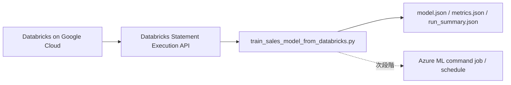

# 検証 3 詳細レポート: Databricks データを利用した AI モデル再学習

## 1. 検証目的

Google Cloud 上の Databricks にある売上データを Azure 側の学習処理から取得し、AI モデルの再学習に利用できることを確認する。

今回の検証では、Azure Machine Learning の定期実行へ進む前段として、ローカル実行の PoC により次を確認した。

- Databricks SQL Warehouse から学習対象データを取得できること
- 取得した最新データを使ってモデル学習処理を実行できること
- 学習済みモデル、評価指標、実行サマリーを artifact として保存できること
- 将来的に Azure ML command job / schedule に載せられる実行単位として整理できること

## 2. 検証範囲

### 実施済み

| 項目 | 状態 |
| --- | --- |
| Databricks からの学習データ取得 | 完了 |
| ローカル学習スクリプトの実行 | 完了 |
| モデル artifact の出力 | 完了 |
| metrics artifact の出力 | 完了 |
| 実行サマリーの出力 | 完了 |
| 手順書への検証結果記録 | 完了 |

### 未実施

| 項目 | 状態 |
| --- | --- |
| Azure ML command job 化 | 完了 |
| Azure ML schedule 化 | 未実施 |
| Azure ML Model Registry への登録 | 未実施 |
| Key Vault / Managed Identity を使った本番相当の資格情報管理 | 未実施 |
| モデル精度改善 | 検証対象外 |

## 3. 使用リソース

| 種別 | 値 |
| --- | --- |
| Databricks workspace | `8259552429116742.2.gcp.databricks.com` |
| Databricks SQL Warehouse ID | `729062798c1046d0` |
| 学習データソース | `workspace.default.sales_transactions_sync_test` |
| 実行スクリプト | `samples/train_sales_model_from_databricks.py` |
| 出力ディレクトリ | `outputs/sales-price-model` |
| 認証方式 | Databricks PAT を実行時プロンプトで入力 |
| Azure ML Workspace | `mlw-ti-demo-databricks-swc` |

## 4. 検証構成



今回の実行はローカル PoC として行った。Databricks PAT はチャットやファイルには保存せず、実行時プロンプトに直接入力した。

## 5. 実装内容

### 学習スクリプト

追加したスクリプト:

```text
samples/train_sales_model_from_databricks.py
```

主な処理:

1. Databricks Statement Execution API を呼び出す
2. `workspace.default.sales_transactions_sync_test` から学習対象列を取得する
3. `quantity`, `unitPrice`, `totalPrice` を数値に変換する
4. 学習データとテストデータに分割する
5. `quantity`, `unitPrice` を特徴量として `totalPrice` を予測する ridge regression を学習する
6. テストデータで `mae`, `rmse`, `r2` を算出する
7. `model.json`, `metrics.json`, `run_summary.json` を出力する

取得 SQL:

```sql
SELECT transactionID, quantity, unitPrice, totalPrice, product, dateTime
FROM workspace.default.sales_transactions_sync_test
WHERE quantity IS NOT NULL
  AND unitPrice IS NOT NULL
  AND totalPrice IS NOT NULL
LIMIT 500
```

### モデル仕様

| 項目 | 値 |
| --- | --- |
| モデル種別 | `ridge_regression` |
| 目的変数 | `totalPrice` |
| 入力特徴量 | `quantity`, `unitPrice` |
| 正則化係数 | `ridge_lambda: 1.0` |

当初の通常の線形回帰では、検証データの特徴量に十分なばらつきがなく、正規方程式が特異になった。そのため、PoC がデータ分布に過度に依存して停止しないよう、ridge 正則化を追加した。

## 6. 実行コマンド

```powershell
python samples/train_sales_model_from_databricks.py `
    --source-table workspace.default.sales_transactions_sync_test `
    --limit 500 `
    --output-dir outputs/sales-price-model
```

実行時に次のプロンプトが表示され、Databricks PAT をターミナルに直接入力した。

```text
Databricks PAT or Authorization header value:
```

## 7. 実行結果

実行は成功し、次の JSON が出力された。

```json
{
  "source_table": "workspace.default.sales_transactions_sync_test",
  "output_dir": "outputs\\sales-price-model",
  "metrics": {
    "rows": 10,
    "mae": 24.901760678187163,
    "rmse": 78.72784288583522,
    "r2": -10.792376798814223
  }
}
```

### 実行サマリー

`outputs/sales-price-model/run_summary.json`:

```json
{
  "source_table": "workspace.default.sales_transactions_sync_test",
  "trained_at": "2026-07-06T20:17:19.654178+00:00",
  "train_rows": 40,
  "test_rows": 10,
  "metrics": {
    "rows": 10,
    "mae": 24.901760678187163,
    "rmse": 78.72784288583522,
    "r2": -10.792376798814223
  }
}
```

### 評価指標

`outputs/sales-price-model/metrics.json`:

| 指標 | 値 | 意味 |
| --- | --- | --- |
| `rows` | `10` | 評価に使用したテストデータ件数 |
| `mae` | `24.901760678187163` | 平均絶対誤差 |
| `rmse` | `78.72784288583522` | 平均二乗誤差平方根 |
| `r2` | `-10.792376798814223` | 決定係数 |

### モデル artifact

`outputs/sales-price-model/model.json`:

```json
{
  "model_type": "ridge_regression",
  "target": "totalPrice",
  "features": [
    "quantity",
    "unitPrice"
  ],
  "ridge_lambda": 1.0,
  "intercept": 0.013096402566006896,
  "weights": {
    "quantity": 2.999456580806432,
    "unitPrice": -3.410605131648481e-13
  }
}
```

## 8. 評価

### 確認できたこと

- Databricks の `workspace.default.sales_transactions_sync_test` から学習データを取得できた
- 取得データを使って学習処理を正常終了できた
- 学習行数、評価行数、metrics、モデルパラメーターを artifact として保存できた
- スクリプトは CLI 実行可能で、Azure ML command job に載せやすい形になっている

### 精度について

今回の `r2` は低いが、この検証の主目的はモデル精度の最適化ではない。目的は、Databricks のデータを Azure 側の学習処理に渡し、再学習 artifact と評価指標を追跡できることの確認である。

精度改善を検証対象に含める場合は、次の改善が必要になる。

- 学習データ件数を増やす
- `product`, `paymentMethod`, `franchiseID` などのカテゴリ特徴量を追加する
- 時系列分割またはランダム分割の方針を明確化する
- Azure ML の AutoML または scikit-learn / MLflow を使ったモデル管理へ移行する

## 9. 発生した問題と対応

| 事象 | 原因 | 対応 |
| --- | --- | --- |
| `Training data is singular; use more varied rows.` | 検証データの特徴量に十分なばらつきがなく、通常の線形回帰の連立方程式が特異になった | ridge 正則化を追加し、`model_type` を `ridge_regression` とした |
| `HTTP Error 401: Unauthorized` | 入力した Databricks PAT が無効、期限切れ、または入力形式が不正だった | 有効な PAT を再入力して再実行し、成功を確認した |

## 10. Azure ML Command Job 実行結果

Azure ML Workspace を作成し、`samples/train_sales_model_from_databricks.py` を Command Job として 1 回だけ手動実行した。

| 項目 | 結果 |
| --- | --- |
| Azure ML Workspace | `mlw-ti-demo-databricks-swc` |
| Resource Group | `rg-ti-demo-ai-agents-swc` |
| Location | `swedencentral` |
| Command Job | `epic_calypso_078fs96qj7` |
| Job status | `Completed` |
| system datastore auth mode | `identity` |
| ダウンロード先 | `azureml-downloads/epic_calypso_078fs96qj7/artifacts/outputs/sales-price-model` |

Azure ML job からダウンロードした artifact に対して、検証スクリプトを実行した。

```powershell
python samples/verify_sales_model_artifacts.py `
    --artifact-dir azureml-downloads/epic_calypso_078fs96qj7/artifacts/outputs/sales-price-model `
    --min-train-rows 1 `
    --min-test-rows 1
```

結果:

```json
{
  "status": "passed",
  "artifact_dir": "azureml-downloads\\epic_calypso_078fs96qj7\\artifacts\\outputs\\sales-price-model",
  "model_type": "ridge_regression",
  "train_rows": 40,
  "test_rows": 10,
  "metrics": {
    "rows": 10,
    "mae": 24.901760678187163,
    "rmse": 78.72784288583522,
    "r2": -10.792376798814223
  }
}
```

この結果により、Databricks のデータを使った再学習処理を Azure ML Command Job として実行し、出力 artifact を取得・検証できることを確認した。

## 11. 合格条件との対応

| 合格条件 | 結果 |
| --- | --- |
| 再学習ジョブが Databricks の最新データを抽出できる | 合格。Statement Execution API 経由で学習データを取得できた |
| 学習処理を実行できる | 合格。ridge regression の学習が完了した |
| 評価指標を追跡できる | 合格。`metrics.json` と `run_summary.json` に保存済み |
| モデル artifact を追跡できる | 合格。`model.json` に保存済み |
| Azure ML Command Job として再学習を実行できる | 合格。`epic_calypso_078fs96qj7` が `Completed` になった |
| スケジュールに従って再学習パイプラインが起動する | 未実施。Azure ML schedule 化が必要 |
| 評価結果に基づいてモデル登録またはデプロイ可否を判定できる | 未実施。Azure ML / MLflow 連携が必要 |

## 12. 結論

検証 3 のローカル PoC として、Databricks のデータを利用した再学習処理は成功した。

今回確認できた範囲では、Databricks の売上テーブルから学習データを抽出し、モデルを学習し、評価指標とモデル artifact を保存できている。さらに、Azure ML Command Job として 1 回だけ手動実行し、job が `Completed` になることと、job artifact をダウンロードして検証できることも確認した。

一方で、本番寄りの「定期的に AI モデルを再学習する」検証として完了させるには、Azure ML schedule 化、Key Vault 連携、モデル登録までを追加で確認する必要がある。

## 13. 次の推奨ステップ

1. Databricks PAT を Key Vault または Azure ML の secure environment variable から渡す構成に置き換える
2. Azure ML schedule を作成し、日次または任意間隔で再学習を実行する
3. Databricks 側のデータ更新後、次回 schedule 実行で artifact が更新されることを確認する
4. `metrics.json` の値を Azure ML / MLflow metrics として記録する
5. 必要に応じて Azure ML Model Registry へモデルを登録する